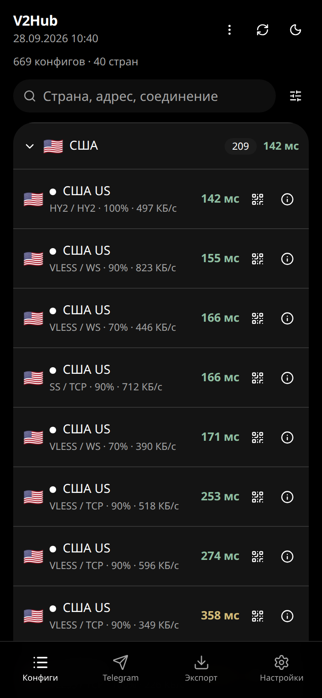

# V2Hub

V2Hub собирает уже опубликованные конфиги и прокси Telegram, проверяет их и выкладывает списки. Это агрегатор, тестер и экспорт. Это не VPN-клиент: сайт сам никуда не подключает и туннель не поднимает.

Сайт: [https://nyrokume.github.io/vless-hub/](https://nyrokume.github.io/vless-hub/)



## Содержание

- [Быстрый старт](#быстрый-старт)
- [Что умеет](#что-умеет)
- [Как проходит проверка](#как-проходит-проверка)
- [Подписки](#подписки)
- [Приложения](#приложения)
- [Прокси Telegram](#прокси-telegram)
- [Вопросы](#вопросы)
- [Разработчикам](#разработчикам)
- [Автор](#автор)
- [Лицензия](#лицензия)

Подробности: [проверка](docs/testing.md), [подписки и приложения](docs/subscriptions.md), [сборка и источники](docs/development.md), [журнал](CHANGELOG.md).

## Быстрый старт

1. Откройте [сайт](https://nyrokume.github.io/vless-hub/).
2. На вкладке «Конфиги» возьмите нужные строки или на «Экспорте» выберите готовый список.
3. Добавьте ссылку в своё приложение. Кнопка приложения открывает Happ, v2RayTun, Hiddify или v2rayNG. Если приложение не открылось, скопируйте ссылку и вставьте её сами.

## Что умеет

- Показывает рабочие конфиги VLESS, Shadowsocks, Trojan и Hysteria2. Поиск ищет страну и адрес. Фильтры меняют пинг, страну, защиту, тип соединения, порядок и вид списка.
- Пинг — сколько миллисекунд сайт отвечает уже после подключения. Зелёный быстрее 300 мс, жёлтый от 300 до 800, красный медленнее. Процент — какая доля последних проверок прошла. Скорость — как быстро скачался короткий файл.
- В списке только то, что прошло проверку в текущем прогоне. Залитая точка — все ступени пройдены.
- «Экспорт» отдаёт текст, код base64, файл, QR, Clash и sing-box. С выбранных строк можно выгрузить то же самое.
- Вкладка Telegram показывает прокси, которые в этом прогоне дошли до серверов Telegram: SOCKS открыл туннель и получил ответ, MTProto прошёл рукопожатие. Кнопка открывает Telegram и подставляет прокси.
- Пока вкладка открыта, список обновляется сам, примерно раз в минуту, без перезагрузки. Поиск, фильтры и открытая карточка остаются. Кнопка со стрелками в шапке скачивает список сразу.
- «Живой парс» в меню «Конфигов» читает открытые списки в браузере и показывает только новые строки. Они помечены «не проверены» и не смешиваются с проверенным списком.
- В «Настройках» те же пояснения лежат свёрнутыми пунктами. Туда же можно вставить ссылку VLESS и посмотреть, из чего она состоит. Разбор остаётся в браузере.

## Как проходит проверка

Проверка идёт с серверов GitHub за пределами России. Конфиг, который открылся там, домашний провайдер может закрыть.

Ссылка сначала разбирается. Одинаковые сервер, порт и ключ схлопываются в один конфиг. Дальше через Xray или sing-box идут все ступени текущего прогона: подключение, два сайта из трёх с правильным ответом (пустая страница generate_204 и настоящая страница, без портала, подмены и ошибки TLS), скачивание с минимальной скоростью и адрес выхода, отличный от адреса сервера проверки. Не прошёл сейчас — сразу убран, прошлый удачный проход не оставляется. В «Настройках», в свёрнутых «Логах», видно сколько отсеялось и почему.

Полный порядок ступеней и причины отказа: [docs/testing.md](docs/testing.md).

## Подписки

Адрес ниже можно вставить в приложение как подписку. Приложение само заберёт новый список при обновлении.

| Список | Адрес |
| --- | --- |
| Все рабочие | https://nyrokume.github.io/vless-hub/sub/all.txt |
| Только VLESS | https://nyrokume.github.io/vless-hub/sub/protocol/vless.txt |
| 20 самых быстрых | https://nyrokume.github.io/vless-hub/sub/top-20.txt |
| Clash | https://nyrokume.github.io/vless-hub/sub/clash.yaml |
| sing-box | https://nyrokume.github.io/vless-hub/sub/singbox.json |

Остальные срезы, base64, страны и файлы Telegram: [docs/subscriptions.md](docs/subscriptions.md).

## Приложения

| Приложение | Как добавить |
| --- | --- |
| Happ, v2RayTun, Hiddify, v2rayNG | Кнопка на «Экспорте» или скопированная ссылка подписки |
| Streisand | Плюс и вставка скопированной ссылки |
| NekoBox, Clash Meta, Mihomo | Файл Clash |
| sing-box | Файл sing-box |

Пошагово для каждого приложения: [docs/subscriptions.md](docs/subscriptions.md).

## Прокси Telegram

На вкладке Telegram — прокси MTProto и SOCKS, которые в этом прогоне ответили серверу Telegram, а не только открыли порт. Кнопка открывает Telegram и подставляет прокси. Если приложение не открылось, скопируйте ссылку или покажите QR.

Готовые списки: [MTProto](https://nyrokume.github.io/vless-hub/tg/mtproto.txt), [SOCKS](https://nyrokume.github.io/vless-hub/tg/socks.txt), [все ссылки](https://nyrokume.github.io/vless-hub/tg/all.txt), [ссылки для браузера](https://nyrokume.github.io/vless-hub/tg/https.txt).

## Вопросы

**Почему конфиг есть на сайте, а у меня не открывается?**

Проверка идёт не из вашей сети, а с серверов GitHub за пределами России. Провайдер может закрыть адрес, который там открылся. Следующий прогон убирает конфиг, если он больше не проходит.

**Как часто обновляется список?**

Плановая проверка идёт примерно каждые 15 минут. Каждый прогон заново проверяет уже опубликованные конфиги и новые кандидаты. Кто не прошёл, пропадает из списка на следующем прогоне. Пока вкладка открыта, сайт сам подхватывает новый файл. Кнопка в шапке скачивает список сразу.

**Это безопасно?**

Сайт не просит аккаунт и не подключает вас сам. В списке чужие публичные серверы: если вы ими пользуетесь, трафик идёт через чужой компьютер. Не передавайте через такой прокси почту, банк и пароли. Разбор ссылки в «Настройках» остаётся в браузере и никуда не отправляется.

## Разработчикам

Сборщик на Python лежит в `vlesshub/`, сайт на React — в `site/`, источники — в `sources.yaml`. Проверка и деплой — `.github/workflows/update.yml`.

```bash
pip install -r requirements.txt
python -m pytest
python -m vlesshub run --out publish --site site
cd site && npm ci && npm run build
```

Короткий прогон без прокси: `python -m vlesshub run --max-tcp 20 --max-proxy 0 --max-tg 0`.

Как устроены сборщик, проверка в CI и добавление источника: [docs/development.md](docs/development.md).

## Автор

nyrokume.dev · GitHub [Nyrokume](https://github.com/Nyrokume)

## Лицензия

Файл лицензии в репозитории не задан.
